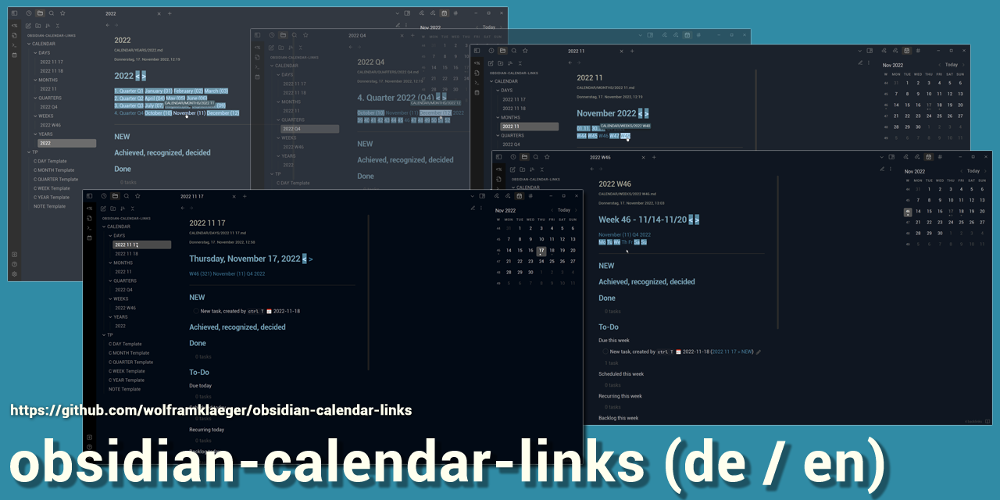

# obsidian-calendar-links-DE
obsidian-calendar-links-de ist ein Vault (Datenordner) für die **Notiz-App Obsidian (Obsidian.md)**, inklusive aller benötigten Erweiterungen, Einstellungen und Vorlagen.

Je **Kalendertag, -woche, -monat, -quartal, -jahr** kann eine Notiz angelegt werden, die automatisch mit dem restlichen Kalender verlinkt ist.

Mit jeder Kalendernotiz wird auch eine **To-Do-Liste** erzeugt, gegliedert nach

- fällig (heute, diese Woche, ... Jahr)
- geplant  (...)
- Routine (...)
- Backlog
- Ohne Datum

Alle Aufgaben, die irgendwo im Vault als Markdown-Checkbox definiert sind, im Standard-Format

- [ ] Beschreibung Fällig-Datum Erledigt-Datum

werden von den To-Do-Listen eingesammelt und in den  Kalendernotizen an passender Stelle einsortiert. Inklusive der *automatischen Zusammenfassung* von Tag, Woche, ... bis Jahr.

Für das Aufgabenmanagement wird die Obsidian Community-Erweiterung [**Obsidian-Tasks**](https://github.com/obsidian-tasks-group/obsidian-tasks) verwendet.

## Deutsche oder englische Version
 
Dies ist **obsidian-calendar-links-DE**, die *deutschsprachige* Version.
 
Also available as [**English (US) version** (obsidian-calendar-links without DE)](https://github.com/wolframklaeger/obsidian-calendar-links/)

Beide Versionen können leicht in andere Sprachen übersetzt werden. Auch die Datumsformate können einfach angepasst werden.

## Verwendete Obsidian-Plugins (vorinstalliert)
 
 - Calendar
 - Dataview
 - Periodic Notes
 - Tasks
 - Templater

## Zusätzlich installierte Plugins (nicht erforderlich)
 
 - Minimal Theme
 - Minimal Theme Settings
 - Recent Files

Der *obsidian-calendar-links-DE* Vault funktioniert mit jedem Obsidian-Theme.

Das *Minimal-Theme* ist vorinstalliert, damit die **mitgelieferten CSS-Snippets** richtig funktionieren. Beides kann problemlos deinstalliert und durch ein anderes Theme / andere Snippets ersetzt werden.
## Einrichten und starten
1. Oben rechts auf **[Code] > Download ZIP**
1. Die .zip Datei herunterladen und entpacken
1. Nach Bedarf
    - den enthaltenen Obsidian-Vault-Ordner *umbenennen*
    - an den *endgültigen Speicherort* verschieben
1. **Obsidian starten**
2. Unten links auf *[Open another vault]*
3. Ordner als Vault öffnen *[Open]*
4. Den Obsidian-Calendar-Links Ordner auswählen
5. vertrau' mir: **ja** und *los geht's!*

Vorausgesetzt, [Obsidian.md](https://obsidian.md/) ist bereits auf deinem aktuellen Gerät installiert - unter Windows, Mac, Linux, IOS oder Android.

